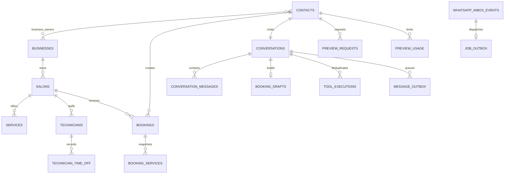

# Data model

Business ownership is explicit through `business_id` and `salon_id`. Contacts are platform-wide WhatsApp identities so preview quotas and cross-salon customer identity do not reset. `business_customers` keeps first/last booking markers per business.

Booking services keep names even after catalog removal. Technician name is snapshotted; `technician_ref` is a nullable UUID without a foreign key by design, so missing/stale staff never invalidates history or flexible booking. Soft deletion uses `active` and `deleted_at` for mutable catalog records.

High-volume indexes cover booking business/cohort, salon/start, customer history, technician/start, recent conversation messages, pending inbox/outbox work, and contact/day preview usage. The initial migration enables RLS on all private tables and grants a platform-admin policy; background services use the service role after trusted edge checks.

No column stores image bytes. `conversation_messages.media_id`, `preview_requests.source_media_id`, and `output_media_ids` are provider identifiers. Raw base64 and temporary image files are prohibited.

After applying migrations locally, run `pnpm db:types`. Commit the generated `src/generated/database.types.ts` with the migration. The current placeholder must be replaced when the first full Supabase Docker stack is available.
