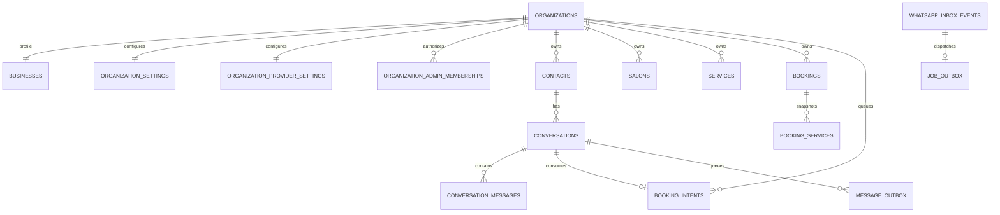

# Data model

`organizations` is the non-inferred tenant root. Each organization has exactly one `businesses`, `organization_settings`, and `organization_provider_settings` row. All operational tables store a non-null organization ID. Parent tables expose `(organization_id,id)` uniqueness and children use composite foreign keys, so a child cannot claim another organization's contact, conversation, booking, preview, salon, or service.

Contacts are unique by `(organization_id,wa_id)`. Inbox provider IDs, outbox/tool/booking deduplication keys, preview request keys, quotas, and conversation identities are likewise unique within organization scope. WABA and receiving phone IDs are unique platform-wide, including archived organizations, because they route provider traffic.

Each booking belongs to the organization business and may have a null salon. Services are immutable name snapshots. `bookings.technician_ref` intentionally remains nullable without a foreign key so historical references survive technician deletion; domain functions accept a current technician only inside the selected organization/salon. `bookings.simulated` is derived from verified conversation channel and protected against updates.

`booking_intents` holds a short-lived (4-hour, extended on reuse) record of a customer's selections from an external booking website, keyed by a per-organization CSPRNG `code` that doubles as a bearer token in a WhatsApp prefill message. `salon_id` and `technician_ref` are plain nullable UUIDs with no foreign key to `technician_ref`, mirroring the `bookings.technician_ref` snapshot invariant; `salon_id` does carry a composite foreign key since, unlike a booking, an intent is never itself a historical record. `salon_id` is null whenever the organization has no active salon or the external site omitted it for a sole active salon, mirroring `bookings.salon_id`'s own nullability; it is required only to disambiguate when several active salons exist. A partial unique index on `(organization_id, params_fingerprint) where consumed_at is null` deduplicates identical concurrent requests instead of creating parallel intents. Claiming sets `consumed_at`/`consumed_conversation_id` exactly once and seeds a `booking_drafts` row whose `origin` column is `external_site` rather than the default conversation-originated `null`.

Organization provider settings contain routing IDs, an optional atomic Meta override, validation version/result, sanitized display/E.164 number, template overrides, and an optional atomic OpenAI override (key, chat model, image model, pricing). Root settings — Meta credentials/default templates and the root OpenAI key/models/pricing — are system-scoped in one `root_settings` table. Credentials are server-only database text and never appear in tenant operational rows, jobs, logs, exports, audit details, or browser-direct queries.

Inbox/job/message/preview/AI rows retain immutable organization scope through retries. Audit rows explicitly distinguish platform scope (no organization ID) from organization scope (required organization ID). RLS mirrors system/active-membership access, while service-role code still filters explicitly.

An empty `service_salons` scope for a service means "available at every salon," not "available nowhere" — enforced identically in the conversation tool catalog, the AI prompt catalog, and the public catalog endpoint (BOOK-08), and now a published contract external callers rely on.
