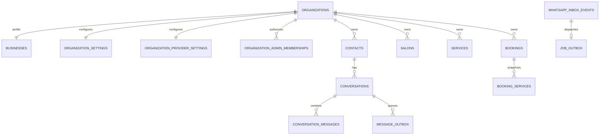

# Data model

`organizations` is the non-inferred tenant root. Each organization has exactly one `businesses`, `organization_settings`, and `organization_provider_settings` row. All operational tables store a non-null organization ID. Parent tables expose `(organization_id,id)` uniqueness and children use composite foreign keys, so a child cannot claim another organization's contact, conversation, booking, preview, salon, or service.

Contacts are unique by `(organization_id,wa_id)`. Inbox provider IDs, outbox/tool/booking deduplication keys, preview request keys, quotas, and conversation identities are likewise unique within organization scope. WABA and receiving phone IDs are unique platform-wide, including archived organizations, because they route provider traffic.

Each booking belongs to the organization business and may have a null salon. Services are immutable name snapshots. `bookings.technician_ref` intentionally remains nullable without a foreign key so historical references survive technician deletion; domain functions accept a current technician only inside the selected organization/salon. `bookings.simulated` is derived from verified conversation channel and protected against updates.

Organization provider settings contain routing IDs, an optional atomic Meta override, validation version/result, sanitized display/E.164 number, template overrides, real-traffic enablement, and organization OpenAI configuration. Root Meta settings are system-scoped. Credentials are server-only database text and never appear in tenant operational rows, jobs, logs, exports, audit details, or browser-direct queries.

Inbox/job/message/preview/AI rows retain immutable organization scope through retries. Audit rows explicitly distinguish platform scope (no organization ID) from organization scope (required organization ID). RLS mirrors system/active-membership access, while service-role code still filters explicitly.
