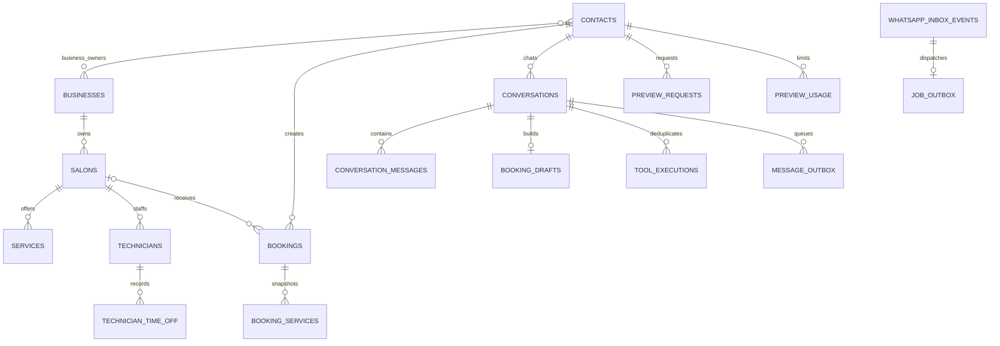

# Data model

`businesses` is a singleton configuration row: a deployment supports one business and one WhatsApp Business Account. Internal `business_id` relations preserve historical integrity, but they never represent a tenant boundary. Contacts are WhatsApp identities so preview quotas and cross-salon customer identity do not reset. `business_customers` keeps first/last booking markers for the configured business.

Conversations are unique per contact/channel: `whatsapp` for real messages and `whatsapp_simulator` for admin tests. Simulator ingress marks its existing inbox JSON payload; outgoing JSON payloads retain `transport=simulator` through durable retries. These use existing columns and need no schema migration.

Bookings always belong to the singleton business, but `salon_id` is nullable when no active salons exist. Every new conversation booking snapshots the configured platform timezone, regardless of salon; the sole active salon is otherwise selected implicitly, and multiple active salons require a choice. The booking RPC rechecks the platform timezone while holding a shared settings-row lock. Existing booking instants and timezone snapshots remain historical; conversation lists and notifications reformat appointment instants in the current platform timezone without visible timezone labels. Salon/technician placeholders such as [N/A] are display values, not stored UUIDs. Conversations store an unrestricted `reply_locale` language tag and the latest AI-written `reply_unavailable_text`; obsolete platform greeting columns have been removed.

Booking services keep names even after catalog removal. Technician name is snapshotted; `technician_ref` is a nullable UUID without a foreign key by design, so missing/stale staff never invalidates history or flexible booking. Soft deletion uses `active` and `deleted_at` for mutable catalog records.

A customer booking update retains the existing confirmed future `bookings` row, including its immutable ID/reference and reporting identity. It updates appointment time labels/timezone snapshot, salon, service snapshots, technician snapshot, and additional request, then appends a `booking.rescheduled` audit event containing prior/new scheduling and service values plus a conversation-call idempotency key. It never creates a cancelled row or replacement booking.

High-volume indexes cover booking business/cohort, salon/start, customer history, technician/start, recent conversation messages, pending inbox/outbox work, and contact/day preview usage. The initial migration enables RLS on all private tables and grants a platform-admin policy; background services use the service role after trusted edge checks.

No column stores image bytes. `conversation_messages.media_id`, `preview_requests.source_media_id`, and `output_media_ids` are provider identifiers. Raw base64 and temporary image files are prohibited.

`ai_usage_events` holds numeric chat/image usage and price snapshots. Service-only read models project inbox/outbox history and aggregate platform metrics without duplicating transcripts; see [platform observability](platform-observability.md).

After applying migrations locally, run `pnpm db:types`. Commit the generated `src/generated/database.types.ts` with the migration. The generator preserves the existing file on failure and can use the running local metadata service if Docker management is unavailable.

The service-only `get_staff_booking_summary` RPC rechecks owner business membership or active technician mappings inside SQL. It aggregates total/confirmed/cancelled/distinct customers over all authorized records, including bookings without salons, with optional timestamp bounds and explicit appointment/created date basis. It does not change dashboard metric definitions.
