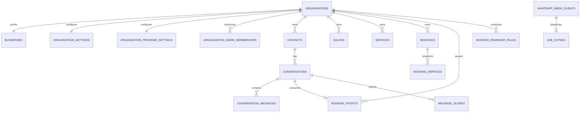

# Data model

`organizations` is the non-inferred tenant root. Each organization has exactly one `businesses`, `organization_settings`, and `organization_provider_settings` row. All operational tables store a non-null organization ID. Parent tables expose `(organization_id,id)` uniqueness and children use composite foreign keys, so a child cannot claim another organization's contact, conversation, booking, preview, salon, or service.

Contacts are unique by `(organization_id,wa_id)`. Inbox provider IDs, outbox/tool/booking deduplication keys, preview request keys, quotas, and conversation identities are likewise unique within organization scope. WABA and receiving phone IDs are unique platform-wide, including archived organizations, because they route provider traffic.

Each booking belongs to the organization business and may have a null salon. Services are immutable name snapshots. `bookings.technician_ref` intentionally remains nullable without a foreign key so historical references survive technician deletion; domain functions accept a current technician only inside the selected organization/salon. `bookings.simulated` is derived from verified conversation channel and protected against updates.

`booking_status` is a three-value enum: `confirmed`, `cancelled`, `checked_in`. A CHECK constraint ties each terminal status to its own timestamp column (`cancelled` requires `cancelled_at`, `checked_in` requires `checked_in_at`); `confirmed` requires neither. `checked_in_at` (`timestamptz`) and `checked_in_by_contact_id` (nullable, `on delete set null` to `contacts`) record when a booking was checked in and which verified staff contact did it; a `booking.checked_in` event is inserted into `booking_events` at the same time, alongside the pre-existing `booking.rescheduled`/`booking.cancelled` events. `checked_in` is reached only through `checkin_organization_booking`, a `security definer` RPC that itself resolves the calling contact's authorization from `business_owners`/`technicians` — the same choke-point pattern as the other booking mutation RPCs (see [authorization](authorization.md)) — and is terminal: `cancel_organization_booking` and `reschedule_organization_booking` both still require `status = 'confirmed'`, so neither accepts a `checked_in` booking.

Exactly one `confirmed` booking with a future `starts_at` is allowed per `(organization_id, contact_id)` at a time — `checked_in` and `cancelled` bookings are excluded from this count, so a completed visit or a cancellation immediately frees the customer to book again. Because `starts_at > now()` is not an immutable predicate, this cannot be a partial unique index; `create_organization_booking` instead takes a per-`(organization_id, contact_id)` `pg_advisory_xact_lock` and then checks for an existing active booking before inserting, raising `active_booking_exists` when one is found. The lock closes the race between two concurrent booking attempts from the same customer; the check-then-insert happens inside the same transaction the lock is held for.

`services.price` (`numeric(10,2)`) and `services.duration_minutes` are both optional and independently nullable, with no default. `null` deliberately means "the owner has not set this" and stays distinct from `0`, a genuinely free or (for duration, disallowed — `check (duration_minutes between 1 and 1440)`) instant service; collapsing the two would make "free" and "unknown" indistinguishable to the external booking website (BOOK-08) and the AI bot. `organization_settings.currency` (`text not null default 'EUR'`) names the unit for `price`: the DB check is a loose `~ '^[A-Z]{3}$'`, matching the `bot_locale` pattern, while the curated, symbol-carrying list enforced at the API boundary lives in `src/lib/currencies.ts` and can grow without a migration.

`bookings.refer_price` and `bookings.refer_duration` (`numeric(10,2)`/`integer`, both `not null default 0`) hold an **advisory** total across the services on that booking, computed once by `create_organization_booking` and recomputed by `reschedule_organization_booking` from the just-written `booking_services` rows — never authoritative, never enforced, and never read back into availability logic. Unlike the catalog columns above, an unset price or duration on a booked service counts as `0` here rather than propagating `null`: a booking total is a single number, and there is no "not set" state for a sum. Existing bookings default to `0`/`0` with no explicit backfill. Do not "fix" this asymmetry to match the catalog's null-vs-zero rule — it is intentional at each level for a different reason.

`booking_intents` holds a short-lived (4-hour, extended on reuse) record of a customer's selections from an external booking website, keyed by a per-organization CSPRNG `code` that doubles as a bearer token in a WhatsApp prefill message. `salon_id` and `technician_ref` are plain nullable UUIDs with no foreign key to `technician_ref`, mirroring the `bookings.technician_ref` snapshot invariant; `salon_id` does carry a composite foreign key since, unlike a booking, an intent is never itself a historical record. `salon_id` is null whenever the organization has no active salon or the external site omitted it for a sole active salon, mirroring `bookings.salon_id`'s own nullability; it is required only to disambiguate when several active salons exist. A partial unique index on `(organization_id, params_fingerprint) where consumed_at is null` deduplicates identical concurrent requests instead of creating parallel intents. Claiming sets `consumed_at`/`consumed_conversation_id` exactly once and seeds a `booking_drafts` row whose `origin` column is `external_site` rather than the default conversation-originated `null`.

Organization provider settings contain routing IDs, an optional atomic Meta override, validation version/result, sanitized display/E.164 number, template overrides (technician confirmation/cancellation and the shared booking-reminder template, `booking_reminder_template`), and an optional atomic OpenAI override (key, chat model, image model, pricing). Root settings — Meta credentials/default templates (including the same `booking_reminder_template` column, as the root fallback) and the root OpenAI key/models/pricing — are system-scoped in one `root_settings` table. Credentials are server-only database text and never appear in tenant operational rows, jobs, logs, exports, audit details, or browser-direct queries.

`booking_reminder_rules` (BOOK-11) is organization-scoped with no root default list — an organization's list starts empty and each admin-added row is a single `offset_minutes` integer (always a whole number of hours; the admin UI only offers hours/days units), unique per `(organization_id, offset_minutes)` so the same time cannot be configured twice. There is deliberately no per-row template column: one shared reminder template, resolved with the organization-over-root precedence described above, serves every row. The background scan dedups on `booking:{bookingId}:reminder:{offsetMinutes}` in `message_outbox` — keyed by the offset rather than this table's own row id — so deleting and re-adding an identical offset can never re-send or double-send a reminder.

Inbox/job/message/preview/AI rows retain immutable organization scope through retries. Audit rows explicitly distinguish platform scope (no organization ID) from organization scope (required organization ID). RLS mirrors system/active-membership access, while service-role code still filters explicitly.

An empty `service_salons` scope for a service means "available at every salon," not "available nowhere" — enforced identically in the conversation tool catalog, the AI prompt catalog, and the public catalog endpoint (BOOK-08), and now a published contract external callers rely on.
