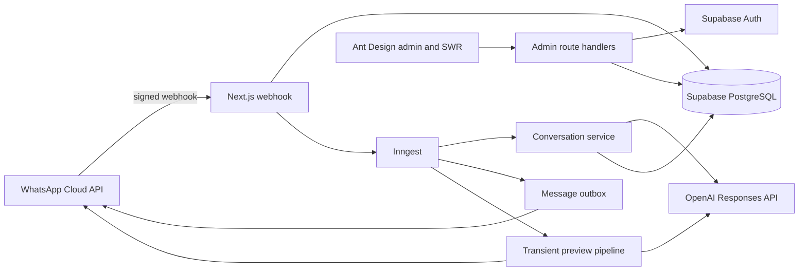

# Architecture overview

Next.js owns UI and trusted route handlers. Supabase owns Auth, durable state, RLS, and atomic operations. Inngest runs retryable work outside the webhook response. WhatsApp adapters translate provider payloads. OpenAI suggests language and function calls; application tools own authorization and mutations.

Dependency direction is `app edge -> feature/domain -> provider adapter`. Provider modules do not decide booking rules. UI components call admin APIs through shared SWR fetchers rather than direct database clients.

Add a customer action in `features/conversation/tools.ts`, a provider capability under `integrations`, a durable job in `inngest/functions.ts`, a dashboard endpoint under `app/api/admin`, and data changes through a new Supabase migration. Each deployment has one business profile and one WhatsApp Business Account.
