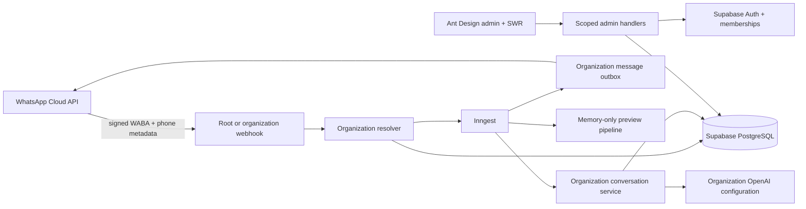

# Architecture overview

`organizations` is the tenant root; each owns one customer-facing business profile. Every operational row, durable event, worker payload, provider call, and dashboard path carries the organization ID. Composite foreign keys and tenant-first uniqueness prevent cross-organization parent references and idempotency collisions.

The permanent root webhook routes each change independently by signed WABA/receiving-phone metadata. The organization callback uses an organization Meta override when configured and otherwise falls back to root Meta credentials. Provider secrets are loaded server-side after scope is fixed and never enter job payloads. Simulator events use the same organization context and domain tools but a distinct channel and delivery transport.

Next.js owns the client-rendered admin UI and trusted route handlers. Supabase owns Auth, durable state, RLS, and atomic operations. Admin layouts, pages, and components do not query Supabase; browser identity and data access use guarded APIs and shared SWR fetchers. Inngest runs retryable work outside the webhook response. Dependency direction is `app edge -> feature/domain -> provider adapter`; provider adapters do not decide domain rules.
