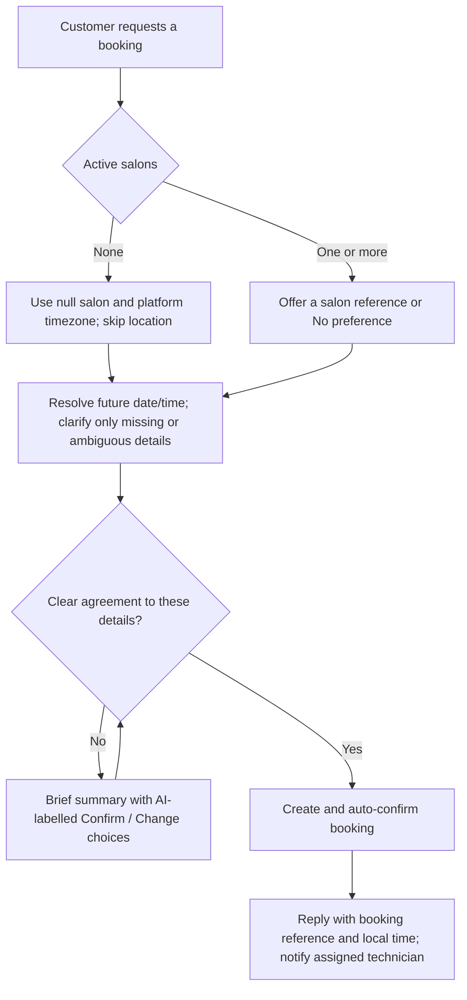

# Conversation flows

## Shared entry

Everything below describes conversations while an organization's AI bot setting is **enabled** (the default) — except for four fast paths that are deterministic in **both** modes, described in [Deterministic fast paths](#deterministic-fast-paths) below. See [Scripted mode](#scripted-mode-ai-bot-disabled) for what happens to every other message with the bot turned off.

Each opening message, greeting, question, image, or interactive tap other than the four fast paths goes through the same AI conversation path. The bot produces one contextual reply, asking at most one focused question. Date and time may be requested together. All text, option titles/descriptions, list headings, and list button labels are generated in the person's language, with no language allowlist. The organization's selected default language is only the initial reference when language is unclear; clear language switches take effect immediately.

## Deterministic fast paths

Four kinds of inbound message need no judgment, so they are handled by pure program code before the AI is ever consulted — in **both** AI-enabled and scripted mode, ahead of everything else described in this document, in this priority order:

1. **Cancel tap.** A tap on a booking confirmation's interactive Cancel button cancels that exact booking immediately, with no follow-up question, no OpenAI call, and no owner/technician command processing. See [Scripted mode](#scripted-mode-ai-bot-disabled) for the reply text.
2. **Check-in tag.** A message containing a `[CHECKIN-<uuid>]` tag — never typed by a customer, only ever sent by a phone that scanned the QR code on a booking confirmation (BOOK-09) — resolves the sender's stored owner/technician mappings and, only if the sender is verified staff of that booking's organization, flips the booking to `checked_in`. The tag is stripped before any text is stored, so it never appears in conversation history or the admin inbox. A staff sender gets a reply confirming the check-in, or that it was already checked in (idempotent replay). A non-staff sender's tag, or a tag naming an unknown/foreign booking, is silently ignored and the message falls through to normal handling as if the tag were not there — matching the existing unknown-`[BK-…]`-code precedent so a stray tag never hints that it means anything.
3. **Update / skip tap.** A tap on the two-option reply offered when a booking attempt hits the active-booking limit (BOOK-10). `booking:update:<uuid>` deterministically reschedules that existing booking to the just-requested details (same booking reference); `booking:skip` acknowledges and leaves the existing booking untouched. Neither ever reaches the model — this keeps the "update or skip" choice deterministic regardless of how the second booking attempt originated (AI chat or a BOOK-07 hand-off).
4. **Booking-intent prefill.** A `[BK-…]` code (BOOK-07) that successfully claims is booked and auto-confirmed on the spot — the customer already made every choice on the external website, so there is nothing left to decide. The reply carries the booking reference and the same one-tap Cancel option. A claim that cannot be booked because the customer already has an active booking (BOOK-10) offers the same two-option Update/Skip reply as above, naming the existing booking's time. A claim that cannot be booked for another reason (its slot has since passed, or the business has since gone inactive) books nothing, leaves the draft `collecting`, and falls through: to the normal AI conversation when the bot is on, or to a static "not available" message when the bot is off. An unknown, expired, or already-consumed code falls through the same way.

All four fast paths reuse the conversation's already-detected language (`conversations.reply_locale`) when one exists, falling back to the organization's configured bot language (`organization_settings.bot_locale`) otherwise — this is true only while the bot is **on**; with the bot off, all four always use `bot_locale` (see [Scripted mode](#scripted-mode-ai-bot-disabled)). None of the four fast paths writes an `ai_usage` row, since no OpenAI call is made.

The AI is not blind to a booking created this way: it is written to conversation history the same as any other reply, and the customer's own bookings (however they were created) are always visible to the `list_my_bookings` tool. A later "move it to 4pm" or "cancel it" request in chat still works normally.

Stored owner/technician mappings select staff assistance. A customer cannot gain staff access by claiming a role in text. Greetings explain relevant capabilities and offer useful actions. Specific opening requests go straight to the requested task instead of receiving an unrelated welcome or location questionnaire.

All date/time interpretation and display uses the configured platform timezone, including today/tomorrow, staff query boundaries, and time off. Interpret supplied clock times in that setting regardless of the person's stated timezone, location, phone country, language, or selected salon. Never ask for or disclose a timezone. Visible messages and controls contain dates and clock times only, without timezone abbreviations, offsets, or explanations such as "your local time". Tools retain offset timestamps internally.

## Customer booking

A clear instruction such as "Book 19 September at 15:00" supplies agreement to those exact details when the date/year and clock time are unambiguous. The timezone is always resolved from platform settings without asking. Otherwise ask for agreement once. Never invent a time, salon or availability. Opening hours, intervals, and time off guide suggestions but do not block bookings.

Reuse all details volunteered by the customer. Salon, services, Other/custom text, technician preference, and additional request are optional. When active salons exist and the customer has not selected one, offer salon choices and a way to continue without preference. Only after the customer selects a salon or No preference, offer helpful service choices when that decision has an applicable catalog. Global services apply at every salon; restricted services apply only to their configured salon locations; No preference sees global services only. Do not ask about an empty applicable service catalog or unconfigured technicians. The catalog is advisory: accept and record typed/custom services even when they are absent from it or unavailable at the selected salon. Only after a salon is selected, offer technician choices whenever that salon has active staff, including a way to continue without preference. Do not ask about technicians when none are active. Optional questions must not postpone booking after the customer skips them.

The app permits no-salon bookings under the active business whether or not salons are active; it never infers a salon from a list. Inactive/stale selected salons fail safely. Store absent details as null or []; omit absent salon and technician details from customer confirmations, and use [N/A] only where an internal template/table needs a value. A new booking does not reuse a completed draft.

Examples with the organization default set to German:

> Customer: Hello!
>
> Bot: [AI-written English greeting with useful English action labels]
>
> Customer: Book tomorrow at 3 pm.
>
> Bot: [If unambiguous and no salon choice is needed, confirms the booking with reference immediately.]

> Customer: Xin chào
>
> Bot: [Vietnamese greeting and Vietnamese controls]
>
> Customer: [Taps a date option]
>
> Bot: [Retains Vietnamese; asks only for the next missing detail.]

Controls are conveniences: 1–3 choices use reply buttons and 4–10 use a list. AI writes labels; internal IDs carry meaning and entity identity. Free text, custom services, corrections, and typed alternatives to a displayed subset remain accepted.

## Owner

A verified owner's greeting explains business booking lists/customer details, booking summaries, and management of salon details, services, and technicians. It offers relevant owner actions rather than customer booking intake. `owner_list_bookings` can include past/future and confirmed/cancelled records, filter by appointment dates/status, and paginate 20 records at a time; missing salon/technician displays as [N/A]. Every call rechecks the stored business membership.

## Technician

A verified technician's greeting explains upcoming assigned bookings/customer details, database summaries, and optional time off. It offers those actions in the technician's conversation language, not the customer's language. It cannot list the entire business's bookings or manage the business. Active stored mappings are rechecked inside each tool. Time off never cancels or blocks bookings. A contact with both roles can use both sets of abilities; staff may explicitly request personal customer bookings.

## Cancellation

Only the same customer may cancel a confirmed booking before its start time. The transactional function checks ownership, status, and time, so a `checked_in` booking — like a past or already-cancelled one — cannot be cancelled. The response includes the booking reference; a resolvable technician receives a deduplicated cancellation notification. Missing salon relations are displayed as [N/A]. Cancelled records remain in reports.

Every booking confirmation — AI-written or scripted — also carries a single interactive Cancel option encoding that booking's ID (`booking:cancel:<uuid>`) in the button itself. Tapping it cancels that exact booking immediately, in either mode, without asking a follow-up question or reaching the model: the tap is recognized and handled before any other processing. In AI-enabled mode, a `booking:cancel:<id>` selection appearing in conversation history tells the model that cancellation already happened deterministically, so it never re-asks or re-cancels.

## Rescheduling

A customer may change the date/time, salon, services, technician, or additional request of their own confirmed booking before it starts; a `checked_in` booking is terminal and can no longer be rescheduled. The assistant identifies the intended future booking (asking only when more than one could apply), then updates it in place. The immutable booking reference and reporting identity remain unchanged. The database records a `booking.rescheduled` event with prior/new time, salon, and technician values plus an idempotency key; it neither creates a cancellation nor a replacement booking. If the technician changes, the former technician receives the normal cancellation notification for their former assignment and the new technician receives the normal confirmation notification with the updated details. A past, cancelled, checked-in, foreign, inactive-salon, or otherwise non-updatable booking fails safely.

## Check-in

Every booking confirmation the customer receives — AI-written or scripted (BOOK-09) — carries a QR code image. The QR encodes a `wa.me` click-to-chat link to the salon's own WhatsApp number, prefilled with a short human-readable line plus a `[CHECKIN-<uuid>]` tag naming that exact booking. Nothing about the tag or the underlying booking ID is secret — the customer already holds it as their booking reference — so authorization rests entirely on who sends the message, never on knowledge of the tag.

At the salon, staff scan the customer's QR with their own phone; WhatsApp opens with the text already filled in; they send it as-is. The webhook recognizes the `[CHECKIN-…]` tag (see [Deterministic fast paths](#deterministic-fast-paths)) and resolves the sender against stored `business_owners`/`technicians` mappings for that booking's organization — any owner or any active technician may check in any booking in the business, regardless of which technician (if any) is assigned to it. A verified sender flips the booking to `checked_in`, recording the check-in time and the checking-in contact, and receives a short confirmation reply. Re-sending the same tag (e.g. a duplicate scan) replies that the booking is already checked in and changes nothing. A sender who is not a verified owner or technician for that organization is treated as if the tag were absent: no state changes, and the message falls through to normal handling.

`checked_in` is terminal: see [Cancellation](#cancellation) and [Rescheduling](#rescheduling). It does **not** count toward the [active booking limit](#active-booking-limit) — checking in immediately frees the customer to book again. The QR image is generated and delivered by a dedicated background job, decoupled from the reply that confirms the booking, so a delivery failure never costs the customer their booking confirmation. Simulated conversations capture an image record instead: the authenticated simulator route regenerates its QR on demand from the booking ID and salon number, without calling Meta or persisting image bytes (see [Image preview](#image-preview)).

## Active booking limit

A customer may hold at most one active booking per organization at a time. Active means `confirmed` with a future start time; `cancelled` and `checked_in` bookings never count, so a completed visit or a cancellation immediately frees the customer to book again. The database enforces this transactionally (an advisory lock serializes the check against concurrent booking attempts from the same customer), regardless of whether the attempt came from the AI conversation or a BOOK-07 external-website hand-off.

When a booking attempt would create a second active booking, nothing is created. Instead the customer is offered exactly two choices, naming the existing booking's time:

- **Update** (`booking:update:<uuid>`) — deterministically reschedules the existing booking to the details just requested, keeping its booking reference. This never goes through the AI, even when the bot is enabled, so the outcome for a given tap is identical to the ordinary [Rescheduling](#rescheduling) path once applied.
- **Skip** (`booking:skip`) — acknowledges and leaves the existing booking untouched.

See [Deterministic fast paths](#deterministic-fast-paths) for how the tap is recognized, and BOOK-10.

## Scripted mode (AI bot disabled)

Turning an organization's AI bot off (BOT-01) replaces the AI conversation path above with deterministic, non-AI handling for everything that isn't already one of the [deterministic fast paths](#deterministic-fast-paths) — no OpenAI call is made for any inbound message, and owner/technician command processing is skipped entirely (there is no model available to interpret staff commands). Every reply is built from the static, localized copy dictionary keyed by the organization's configured bot language, never AI-detected.

For each inbound message, in priority order:

1. **Cancel tap.** Handled first, identically in both modes: cancel that booking immediately, no follow-up question, reply contains the External Website URL. See [Deterministic fast paths](#deterministic-fast-paths).
2. **Check-in tag.** A `[CHECKIN-<uuid>]` tag from a verified owner/technician is handled identically in both modes: see [Check-in](#check-in). A non-staff sender's tag falls through to the greeting below.
3. **Update / skip tap.** `booking:update:<uuid>` or `booking:skip` is handled identically in both modes: see [Active booking limit](#active-booking-limit).
4. **Booking-intent prefill.** A `[BK-…]` code (BOOK-07) is claimed and, identically in both modes, booked and auto-confirmed on the spot. The reply carries the booking reference and the same one-tap Cancel option described above. A claim blocked by the active-booking limit offers the same Update/Skip reply as in AI-enabled mode. An expired, unknown, already-consumed, or not-currently-bookable code falls through to the greeting below instead of erroring.
5. **Everything else.** If the customer has a future confirmed booking, offer the same deterministic Update/Skip choice as the active-booking-limit path rather than greeting them again. Otherwise, send a static greeting naming the organization's External Website URL (or the deployment's own root URL, if the organization has not set one), inviting the customer to book there.

With the bot off, scripted replies do not infer or persist a conversation language (`conversations.reply_locale`) the way AI replies do, since there is no detection step; they always use the organization's configured bot language. A scripted turn writes no `ai_usage` row.

## Technician notification templates

Approved Meta templates retain their provider-defined content. The app uses the saved confirmed/cancelled template names and configured language code. For both, body parameters are: {{1}} salon name, {{2}} customer name, {{3}} customer WhatsApp number, {{4}} appointment date and clock time in the platform timezone without a timezone label, {{5}} booking reference. Missing required display details use [N/A]. When a booking update reassigns a technician, the former technician receives the cancelled template/ordinary cancellation notification for the former assignment, and the new technician receives the confirmed template/ordinary confirmation notification containing the updated details. Without a template, AI writes the ordinary notification in the recipient technician's stored conversation language, falling back to the organization's selected default language — unless the organization's AI bot is disabled (BOT-01), in which case the ordinary notification instead uses static localized text from the same copy dictionary scripted mode uses, keyed by the organization's configured bot language. Ordinary messages still require that technician's own open Meta service window. Cancellation notifications and booking lists reformat stored appointment instants using current platform settings, so historical labels containing a timezone are not reused. Neutral fallback receipts and notification text use the same date/time format.

## Image preview

Ask for a hand/nail photo and desired style, reusing the latest usable media ID when appropriate. Reserve the contact/day quota and generate/upload in memory. Captions and failure text follow the recipient's language. Quota errors are explained naturally by the AI. All delivery uses the durable outbox; no application storage retains image bytes.

The admin simulator uses these same language, role, tool and interactive paths with captured delivery. It renders generated check-in QR images, but does not support photo uploads, image-preview generation, or Meta template/window validation.
