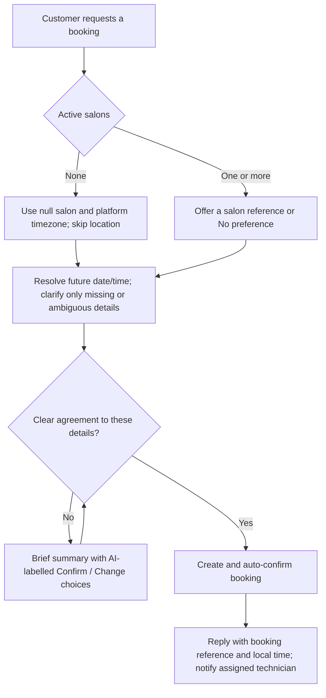

# Conversation flows

## Shared entry

Each opening message, greeting, question, image, or interactive tap goes through the same AI conversation path. The bot produces one contextual reply, asking at most one focused question. Date and time may be requested together. All text, option titles/descriptions, list headings, and list button labels are generated in the person's language, with no language allowlist. `BOT_LOCALE` is only the initial reference when language is unclear; clear language switches take effect immediately.

Stored owner/technician mappings select staff assistance. A customer cannot gain staff access by claiming a role in text. Greetings explain relevant capabilities and offer useful actions. Specific opening requests go straight to the requested task instead of receiving an unrelated welcome or location questionnaire.

All date/time interpretation and display uses the configured platform timezone, including today/tomorrow, staff query boundaries, and time off. Interpret supplied clock times in that setting regardless of the person's stated timezone, location, phone country, language, or selected salon. Never ask for or disclose a timezone. Visible messages and controls contain dates and clock times only, without timezone abbreviations, offsets, or explanations such as "your local time". Tools retain offset timestamps internally.

## Customer booking

A clear instruction such as "Book 19 September at 15:00" supplies agreement to those exact details when the date/year and clock time are unambiguous. The timezone is always resolved from platform settings without asking. Otherwise ask for agreement once. Never invent a time, salon or availability. Opening hours, intervals, and time off guide suggestions but do not block bookings.

Reuse all details volunteered by the customer. Salon, services, Other/custom text, technician preference, and additional request are optional. When active salons exist and the customer has not selected one, offer salon choices and a way to continue without preference. Only after the customer selects a salon or No preference, offer helpful service choices when that decision has an applicable catalog. Global services apply at every salon; restricted services apply only to their configured salon locations; No preference sees global services only. Do not ask about an empty applicable service catalog or unconfigured technicians. The catalog is advisory: accept and record typed/custom services even when they are absent from it or unavailable at the selected salon. Only after a salon is selected, offer technician choices whenever that salon has active staff, including a way to continue without preference. Do not ask about technicians when none are active. Optional questions must not postpone booking after the customer skips them.

The app permits no-salon bookings under the active business whether or not salons are active; it never infers a salon from a list. Inactive/stale selected salons fail safely. Store absent details as null or []; omit absent salon and technician details from customer confirmations, and use [N/A] only where an internal template/table needs a value. A new booking does not reuse a completed draft.

Examples with `BOT_LOCALE=de`:

> Customer: Hello!
>
> Bot: [AI-written English greeting with useful English action labels]
>
> Customer: Book tomorrow at 3 pm.
>
> Bot: [If unambiguous and no salon choice is needed, confirms the booking with reference immediately.]

> Customer: Xin chào
>
> Bot: [Vietnamese greeting and Vietnamese controls]
>
> Customer: [Taps a date option]
>
> Bot: [Retains Vietnamese; asks only for the next missing detail.]

Controls are conveniences: 1–3 choices use reply buttons and 4–10 use a list. AI writes labels; internal IDs carry meaning and entity identity. Free text, custom services, corrections, and typed alternatives to a displayed subset remain accepted.

## Owner

A verified owner's greeting explains business booking lists/customer details, booking summaries, and management of salon details, services, and technicians. It offers relevant owner actions rather than customer booking intake. `owner_list_bookings` can include past/future and confirmed/cancelled records, filter by appointment dates/status, and paginate 20 records at a time; missing salon/technician displays as [N/A]. Every call rechecks the stored business membership.

## Technician

A verified technician's greeting explains upcoming assigned bookings/customer details, database summaries, and optional time off. It offers those actions in the technician's conversation language, not the customer's language. It cannot list the entire business's bookings or manage the business. Active stored mappings are rechecked inside each tool. Time off never cancels or blocks bookings. A contact with both roles can use both sets of abilities; staff may explicitly request personal customer bookings.

## Cancellation

Only the same customer may cancel a confirmed booking before its start time. The transactional function checks ownership and time. The response includes the booking reference; a resolvable technician receives a deduplicated cancellation notification. Missing salon relations are displayed as [N/A]. Cancelled records remain in reports.

## Rescheduling

A customer may change the date/time, salon, services, technician, or additional request of their own confirmed booking before it starts. The assistant identifies the intended future booking (asking only when more than one could apply), then updates it in place. The immutable booking reference and reporting identity remain unchanged. The database records a `booking.rescheduled` event with prior/new time, salon, and technician values plus an idempotency key; it neither creates a cancellation nor a replacement booking. If the technician changes, the former technician receives the normal cancellation notification for their former assignment and the new technician receives the normal confirmation notification with the updated details. A past, cancelled, foreign, inactive-salon, or otherwise non-updatable booking fails safely.

## Technician notification templates

Approved Meta templates retain their provider-defined content. The app uses the saved confirmed/cancelled template names and configured language code. For both, body parameters are: {{1}} salon name, {{2}} customer name, {{3}} customer WhatsApp number, {{4}} appointment date and clock time in the platform timezone without a timezone label, {{5}} booking reference. Missing required display details use [N/A]. When a booking update reassigns a technician, the former technician receives the cancelled template/ordinary cancellation notification for the former assignment, and the new technician receives the confirmed template/ordinary confirmation notification containing the updated details. Without a template, AI writes the ordinary notification in the recipient technician's stored conversation language, falling back to the environment reference. Ordinary messages still require that technician's own open Meta service window. Cancellation notifications and booking lists reformat stored appointment instants using current platform settings, so historical labels containing a timezone are not reused. Neutral fallback receipts and notification text use the same date/time format.

## Image preview

Ask for a hand/nail photo and desired style, reusing the latest usable media ID when appropriate. Reserve the contact/day quota and generate/upload in memory. Captions and failure text follow the recipient's language. Quota errors are explained naturally by the AI. All delivery uses the durable outbox; no application storage retains image bytes.

The admin simulator uses these same language, role, tool and interactive paths with captured delivery. It supports text/interactive messages, not photo uploads or Meta template/window validation.
