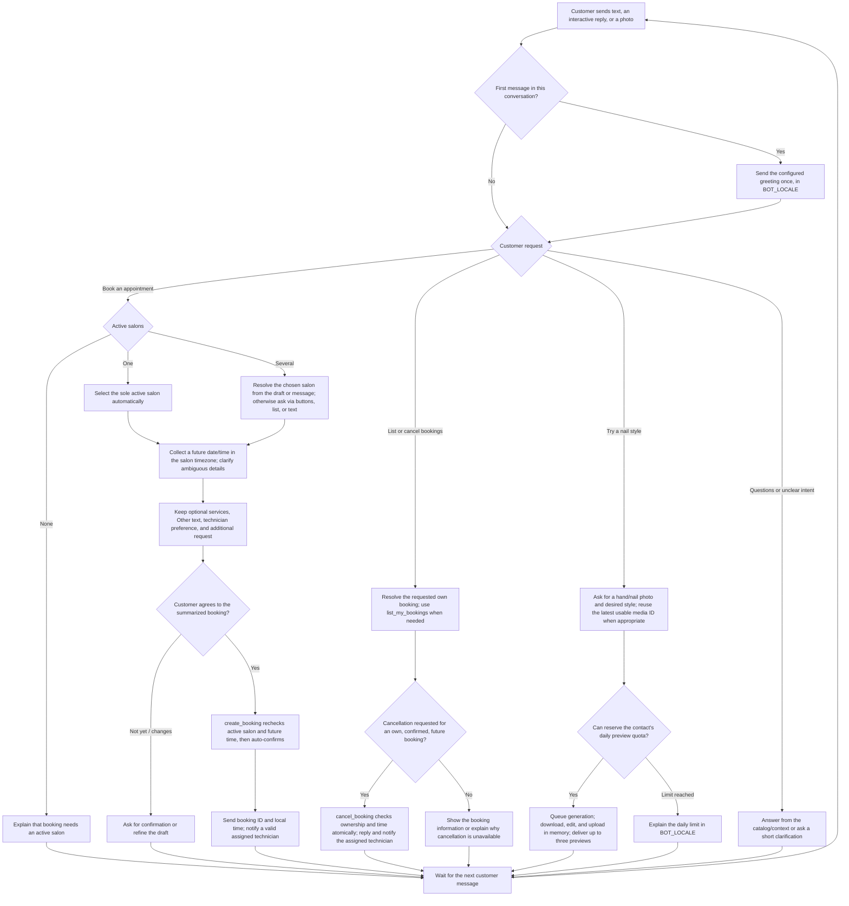

# Conversation flows

## Customer chat overview

This is the customer-facing flow, not a rigid questionnaire: one message can supply several details, and customers can switch intent or correct a draft. Each reply is interpreted using the existing conversation history, current draft, and active catalog. The booking tool rechecks its required conditions when it executes.

The greeting may include salon choices before the customer expresses a booking intent. Only an active salon and a future start time are required to create a booking; services, technician, duration, capacity, and attendance do not block it. The assistant asks for customer agreement before calling the auto-confirming booking tool. Recorded time off only guides technician suggestions.

All replies and notifications use the durable message outbox. Provider failures follow normal job retries/recovery; an unavailable source photo or failed preview may require the customer to resend it. The browser simulator runs the same text/interactive conversation, OpenAI, and tool paths, with captured delivery; its UI does not support the photo-upload/preview branch. See [simulator setup](../development/local-setup.md#browser-whatsapp-simulator) and [shared processing details](../integrations/whatsapp.md#admin-browser-simulator).

## Greeting and salon choice

The first accepted message atomically claims `conversations.greeted_at` and queues the configured greeting in `BOT_LOCALE`. With several active salons, the bot sends up to three reply buttons or a list of up to ten salons. The customer may tap one or type a name/location. With one active salon, the draft records it automatically and offers Book or Try style actions.

Example customer path:

> Customer: Hallo, Saturday around 3 and gel nails please.  
> Bot: [German reply because `BOT_LOCALE=de`] I found two salons. Which location suits you? [list]  
> Customer: The one in Mitte.  
> Bot: Saturday 19 September at 15:00, Mitte, gel nails, no technician preference. Shall I book it?  
> Customer: Yes.  
> Bot: Your booking is confirmed, with booking ID and local time.

Dates supplied to the booking tool are ISO timestamps with an offset based on the salon timezone. A vague or conflicting date gets a concise clarification. No capacity or duration check is introduced.

## Optional catalog

When a salon has services, they are suggestions and several may be selected. `Other` becomes a snapshot with no service ID. With no services, the bot asks for an optional request and continues. Technician choice appears only as an optional preference when the salon setting enables it; a missing or stale technician never stops a booking.

## Cancellation

The bot lists only the contact's own bookings. `cancel_booking` calls a transactional function that succeeds only while the confirmed booking starts in the future. A valid technician recipient receives a deduplicated cancellation message. Cancelled records remain visible.

## Image preview

After an image, the bot asks for the desired style. A later text answer may reuse the most recent WhatsApp media ID in that conversation. The tool reserves the contact/day quota, queues generation, and tells the customer it is processing. Up to three images arrive with short inspiration captions. At quota limit, the localized reply explains that today's requests are used.

## Owner flow

A stored business owner can ask, for example, “How many confirmed bookings did we have this week?” or “Change Mitte closing time to 19:00.” The model receives owned business IDs, and the tool queries the mapping again before each mutation. Owners can create/update/deactivate services and technicians without an onboarding checklist.

## Technician flow

A WhatsApp ID matching active technician records can request upcoming assigned bookings or submit a time-off range. Queries use that identity's technician IDs only. Time off improves suggestions and does not cancel an existing booking.

Controls are conveniences. Every option can be answered in natural text. Expired/stale IDs fail closed in the tool and the bot asks the person to choose again.
